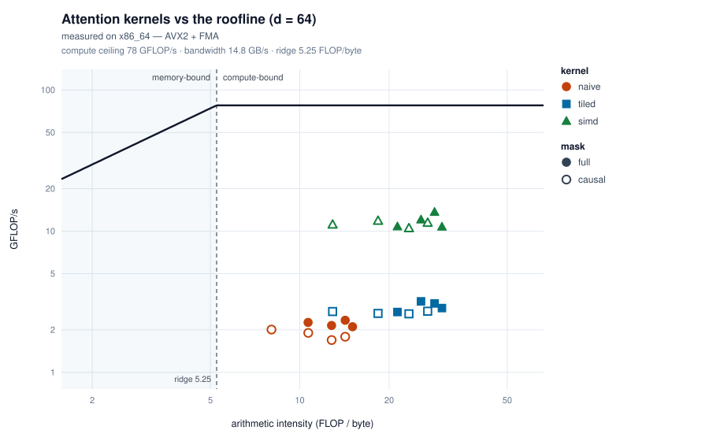

# flash-attn-rs

[](https://github.com/sat-wik/flash-attn-rs/actions/workflows/ci.yml)

Attention kernels in Rust, written to make the *hardware reason* for each
speedup measurable rather than asserted. Three implementations of the same math
— a naive baseline, the Flash Attention tiling algorithm, and an AVX2 version —
plotted against the machine's measured roofline. No runtime dependencies —
`criterion` is the only entry in the manifest and it is dev-only.

## Results

**AVX2 runs 10–14× faster than the naive baseline and reaches 41% of the
machine's measured compute ceiling. Causal block-skipping is worth 2.0×
wall-clock, against a theoretical ideal of exactly 2.0×. Tiling on its own buys
nothing measurable** — which is the interesting part, and the roofline says why.



GFLOP/s on one core of an x86_64 AMD EPYC with AVX2+FMA (a shared vCPU, pinned —
absolute throughput is modest, the ratios are the point), `head_dim = 64`.
Counting only unmasked pairs, so the two masks are comparable.

| full mask | naive | tiled | simd | speedup |
|----------:|------:|------:|-----:|--------:|
| n = 128   | 3.02  | 3.53  | 32.53 | **10.8×** |
| 256       | 2.65  | 3.46  | 31.67 | **11.9×** |
| 512       | 2.37  | 2.78  | 29.84 | **12.6×** |
| 1024      | 2.43  | 2.59  | 27.64 | **11.4×** |

| causal mask | naive | tiled | simd | speedup |
|------------:|------:|------:|-----:|--------:|
| n = 128     | 2.98  | 3.50  | 30.65 | **10.3×** |
| 256         | 2.68  | 3.14  | 30.60 | **11.4×** |
| 512         | 2.74  | 2.84  | 30.87 | **11.3×** |
| 1024        | 2.12  | 2.72  | 29.64 | **14.0×** |

Speedups are ranges because that is what the hardware supports. Across ten runs
the compute ceiling reproduces to a few percent and `simd` to within 2% at most
sizes; a two-decimal speedup would not survive a rerun. Details, and the
measurement bugs found along the way, in
[docs/measurement.md](docs/measurement.md).

```
cargo run --release --bin roofline    # regenerate the figure + its JSON
cargo run --release --bin bench       # both masks, causal speedup, multi-head
cargo run --release --bin blocksweep  # tile size vs throughput
cargo test --release                  # correctness against the naive reference
```

Use `RUSTFLAGS="-C target-cpu=native"`. Add `-- --from-json docs/roofline.json`
to re-render the figure without measuring anything.

## What the numbers say

**Everything here is compute-bound, and that predicts the rest.** The ridge
point — where the bandwidth ceiling crosses the compute ceiling — sits at 5.18
FLOP/byte. Every kernel at every size lands to the right of it, between 8 and 30.
Nothing is waiting on memory, so moving fewer bytes cannot be the lever.

**Which is why tiling buys nothing.** Flash Attention exists to avoid
materializing the `[n×n]` score matrix, cutting traffic from O(n²) to O(n·d),
and the figure shows it doing exactly that — the tiled points sit at twice the
arithmetic intensity of the naive ones, a full step right. At the same height.
Across ten runs the tiled-to-naive ratio lands anywhere from 0.65× to 1.48×
with no source change to either kernel, so the effect is smaller than the noise
around it. **The honest claim is a null result**, and it is the one the roofline
predicts: moving right along a flat ceiling cannot buy throughput.

That is the most interesting finding here. The optimization is correctly
implemented — held to 1e-4 against the reference at five tile sizes — and simply
mis-targeted at this `n` and `d`. Flash's win needs larger `n`, smaller cache,
or the HBM-bound GPU regime it was designed for. Knowing which side of the ridge
you are on *before* optimizing is the whole point.

**Vectorization is the lever that applies**, because being compute-bound means
the way up is issuing better instructions. Beyond the 8-wide dot product, two
changes came from reading the figure rather than guessing, and together they
took the kernel from 22% to 41% of peak:

- **The horizontal reduction** (+46%). An 8-wide dot ends with `extractf128 +
  add + hadd + hadd` — serial, no FMA unit, same cost whether the vector body
  was 8 elements or 64, and it ran once per query-key pair. `dot4_avx2` scores
  four keys against one query and collapses four accumulators in three `hadd`s
  plus a fold, since `hadd(hadd(a,b), hadd(c,d))` leaves all four sums in known
  lanes.
- **The accumulate** (+53%). One `axpy` per key reloaded and restored the whole
  output row every time. Interchanging the loops keeps four accumulators in
  registers across the block, so `out` is touched once at each end. Part of the
  win is not traffic at all: the store-and-reload put store-to-load latency in
  the critical path once per key, and register accumulators turn that dependency
  chain into independent FMAs.

**What is left** is the scalar softmax bookkeeping between blocks — the running
max and normalizer, and the `exp` on block tails shorter than eight. Same
signature as the other two: work that scales with query-key pairs and never
touches an FMA port.

## Multi-head

Heads are independent, so parallelism goes *across* them rather than within.
Each head is already compute-bound, so splitting one buys nothing and would mean
sharing the running softmax state between threads. `std::thread::scope` lets
workers borrow the inputs directly — no dependency, no copying.

On the same 4-vCPU box, `n = 512`: **1.62×** at 2 heads, **2.63×** at 4,
**2.84×** at 8. Sub-linear, partly the hypervisor and partly the join waiting on
the slowest head. That granularity cost is where within-head splitting would
start to earn its complexity.

## Tile size

`BLOCK` sets the inner loop's working set: `2 × BLOCK × d × 4` bytes of K and V
resident at once. `blocksweep` measures the curve across five const-generic
instantiations instead of assuming it — and the answer is machine-specific.

| n | B=16 | B=32 | B=64 | B=128 | B=256 |
|--:|-----:|-----:|-----:|------:|------:|
| 256 | 3.16 | 3.01 | **3.42** | 3.40 | 3.36 |
| 512 | 2.67 | 2.47 | 3.08 | 2.83 | **3.28** |
| 1024 | 2.51 | 2.44 | 2.95 | 2.55 | **3.02** |

`B=128` dips below both neighbours at every size, which is not the shape a
capacity curve has. A 128-row tile spans exactly 32 KB of K at `d = 64`, and
power-of-two strides are the classic way to land every row in one cache set —
but that is a hypothesis, not a finding.

## AVX-512 (opt-in)

`src/avx512.rs` carries the full 16-wide kernel — same online-softmax
bookkeeping and causal block-skipping over `_mm512_*`, with a hardware
`_mm512_reduce_add_ps` and a 16-wide `exp` — wired into `simd::attention`'s
dispatch ahead of the AVX2 arm. It is behind a cfg because `_mm512_*` only
stabilized in Rust 1.89 while the default build targets an older floor; on a
current toolchain it needs no nightly.

```
RUSTFLAGS="-C target-cpu=native --cfg avx512" cargo build --release
```

**No numbers here, because no machine I have access to has AVX-512.** CI builds,
lints and tests it on stable, but the correctness test skips itself rather than
pretend to cover a path it never ran. Expected is **sub-2×** over AVX2 — the
reduction and the scalar softmax tail do not widen, and some parts down-clock
under sustained AVX-512 load. Projected, not observed.

## Layout

```
src/naive.rs      baseline: three passes, materializes [n x n]
src/tiled.rs      online-softmax flash kernel, causal block-skipping
src/simd.rs       AVX2+FMA, vectorized exp, runtime dispatch
src/vexp.rs       8- and 16-wide exp approximation
src/avx512.rs     16-wide kernel, cfg-gated
src/multihead.rs  multi-head batching, serial and parallel
src/roofline.rs   traffic model, measured ceilings, SVG writer, JSON reader
src/bin/          bench, roofline, blocksweep
docs/             figure + data, and the two write-ups below
```

## Further reading

- [docs/online-softmax.md](docs/online-softmax.md) — deriving the running-softmax
  update: why one multiply repairs the whole accumulated history when the max
  moves, why the result is exact rather than approximate, and why the causal
  block-skip falls out of the same structure.
- [docs/measurement.md](docs/measurement.md) — how these numbers were taken,
  what they reproduce to, and the three claims this README got wrong before
  the methodology was fixed.

## License

MIT — see [LICENSE](LICENSE).
